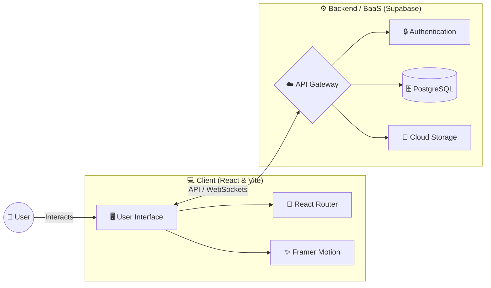

<div align="center">

# Collabnest

*From idea to execution — helping people find the right team and build together.*


</div>

---

## 🏢 Overview

**Collabnest** is a cutting-edge, interactive web application designed to simplify the process of **team building and project collaboration**. Using a dynamic interface and seamless networking features, Collabnest allows creators, developers, and visionaries to connect, share ideas, and build together efficiently.

Our mission is to turn the complex process of finding the right team into an intuitive, seamless experience that inspires innovation and successful execution.

---

## 🚀 Key Features

### 1. 🔍 Project Discovery & Matching
Find the perfect team or the perfect project based on skills and interests:
- **Smart Search:** Filter projects by tech stack and requirements.
- **Skill Matching:** Connect with individuals who complement your abilities.

### 2. 🤝 Seamless Collaboration
Integrated tools designed to make teamwork effortless:
- **Real-Time Messaging:** Communicate instantly with team members.
- **Task Management:** Keep track of goals and progress in one place.

### 3. 🎨 Modern & Intuitive UI
Built with a focus on user experience and aesthetics:
- **Dynamic Animations:** Smooth transitions powered by Framer Motion.
- **Responsive Design:** Looks great on desktop and mobile devices.

### 4. 🔒 Secure Authentication & Data
Robust user management powered by Supabase:
- **Fast Login:** Quick and secure access to your profile and projects.
- **Real-time Database:** Instant updates across the platform.

---

## 🛠️ Tech Stack

| Layer | Technology |
| :--- | :--- |
| 🌐 **Frontend** | React 19, Vite |
| 🎨 **Styling & Animation** | Framer Motion, Lucide React |
| 🧭 **Routing** | React Router DOM |
| ⚙️ **Backend/BaaS** | Supabase |

---

## 🏗️ Project Architecture



## 📦 Getting Started

### Prerequisites

- Node.js (v18 or higher recommended)
- npm or yarn

### Installation

1. Clone the repository:
   ```bash
   git clone https://github.com/anureddyb20/collabnest.git
   ```

2. Navigate into the project directory:
   ```bash
   cd collabnest
   ```

3. Install the dependencies:
   ```bash
   npm install
   ```

### Running the Development Server

Start the Vite development server by running:

```bash
npm run dev
```

This will launch the application locally. Open the provided localhost link in your browser to view the app.

### Building for Production

To create a production-ready build:

```bash
npm run build
```

This will generate a `dist` folder containing the optimized and minified assets.

## 🛠️ Scripts

- `npm run dev`: Starts the local development server.
- `npm run build`: Bundles the app for production.
- `npm run preview`: Previews the production build locally.
- `npm run lint`: Runs ESLint to check for code quality issues.
