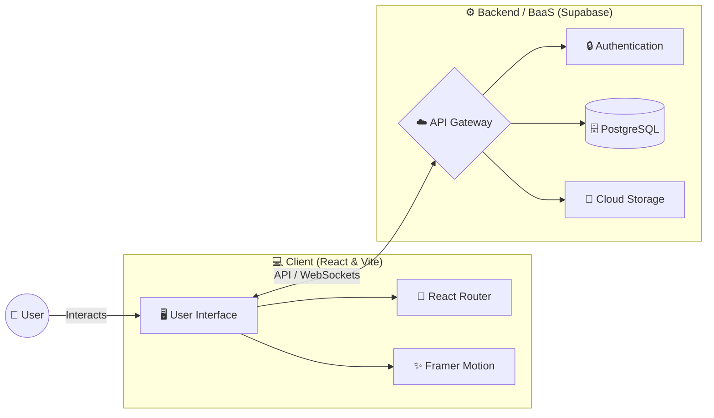

<div align="center">

# Collabnest

*From idea to execution — helping people find the right team and build together.*


</div>

---

## 🏢 Overview

**Collabnest** is a cutting-edge, interactive web application designed to simplify the process of **team building and project collaboration**. Using a dynamic interface and seamless networking features, Collabnest allows creators, developers, and visionaries to connect, share ideas, and build together efficiently.

Our mission is to turn the complex process of finding the right team into an intuitive, seamless experience that inspires innovation and successful execution.

---

## 🚀 Key Features

### 1. 🔍 Project Discovery & Matching
Find the perfect team or the perfect project based on skills and interests:
- **Smart Search:** Filter projects by tech stack and requirements.
- **Skill Matching:** Connect with individuals who complement your abilities.
- **Builder Hub:** Explore skill profiles, get personalized recommendations, and showcase your portfolio in the dedicated builder module.

### 2. 🤝 Seamless Collaboration
Integrated tools designed to make teamwork effortless:
- **Real-Time Messaging:** Communicate instantly with team members using dynamic account chat integration.
- **Task Management:** Keep track of goals and progress in one place.
- **Workspace Management:** Advanced role-based permissions and real-time multi-tab applicant synchronization.

### 3. 🎨 Modern & Intuitive UI
Built with a focus on user experience and aesthetics:
- **Elegant Theme:** A refined organic Cream and Sage palette with elegant gradients and solid shadows.
- **Dynamic Animations:** Smooth transitions powered by Framer Motion.
- **Responsive Design:** Looks great on desktop and mobile devices.

### 4. 🔒 Secure Authentication & Data
Robust user management powered by Supabase:
- **Fast Login:** Quick and secure access to your profile and projects.
- **Real-time Database:** Instant updates across the platform.

---

## 🛠️ Tech Stack

| Layer | Technology |
| :--- | :--- |
| 🌐 **Frontend** | React 19, Vite |
| 🎨 **Styling & Animation** | Framer Motion, Lucide React |
| 🧭 **Routing** | React Router DOM |
| ⚙️ **Backend/BaaS** | Supabase |

---

## 🏗️ Project Architecture



---

## 🛠️ Installation & Setup

### 🔗 Prerequisites

- Node.js (v18+)
- npm

### 1. Clone the Repository

```bash
git clone https://github.com/anureddyb20/collabnest.git
cd collabnest
```

### 2. Install Dependencies

```bash
npm install
```

### 3. Setup Environment Variables

Create a `.env` file in the root directory and add your Supabase credentials:

```env
VITE_SUPABASE_URL=your_supabase_project_url
VITE_SUPABASE_ANON_KEY=your_supabase_anon_key
```

### 4. Run Development Server

```bash
npm run dev
```

The application will be available at:

- **Frontend:** `http://localhost:5173`

---

## 🎯 Manual Usage

If you'd like to run the app locally and explore the features:

1. **Environment Setup:** Ensure your `.env` file is properly configured with your Supabase credentials.
2. **Launch App:** Run `npm run dev` to start the Vite development server.
3. **Explore the Platform:**
   - **Collabnest Dashboard:** `http://localhost:5173`

---

## 🔧 Scripts

- `npm run dev` : Starts the local development server.
- `npm run build` : Bundles the app for production.
- `npm run preview` : Previews the production build locally.
- `npm run lint` : Runs ESLint to check for code quality issues.

---

## 🌍 Impact

---

Lack of effective collaboration tools and team-building platforms hinders **countless innovative ideas** from seeing the light of day. **Collabnest** aims to bridge this gap by connecting creators, developers, and visionaries, accelerating project execution and fostering a vibrant community of builders.

---

<div align="center">
  <p>Developed with passion for a Collaborative & Innovative Future by <b>Anu Reddy B</b></p>
</div>
